#Litefli
**LITEFLI** is a platform dedicated to medical centers and Moroccan citizens to manage vaccination appointments for babies.

**Technologies :** Symfony, PHP, Twig, HTML, CSS, MySQL.

# Authentication And Home page
## Sign-In
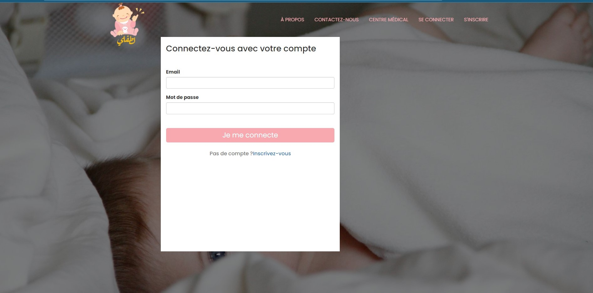
## Sign_Up
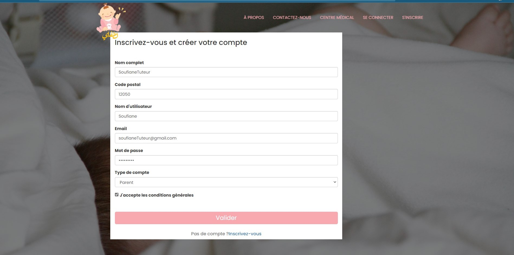
## Home page
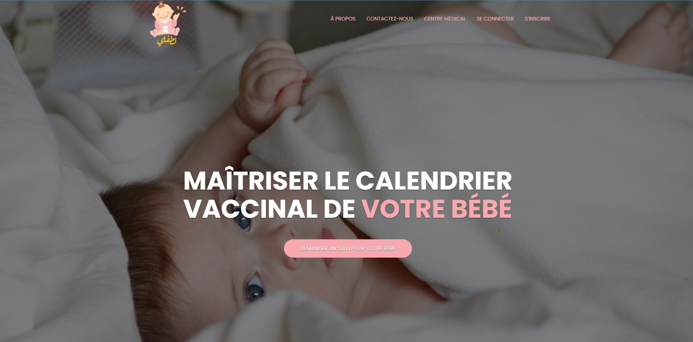
#Medical Centre
## Medical Centre Home Page

## Page Creation Doctor account
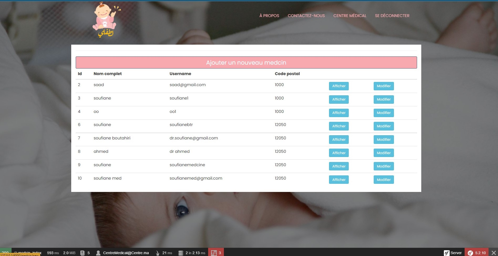

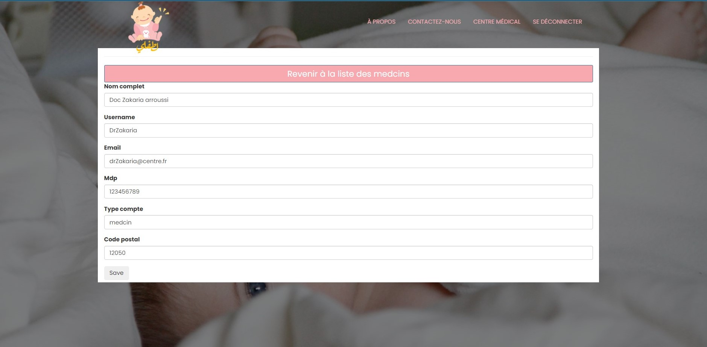
## Page Validation Parent account
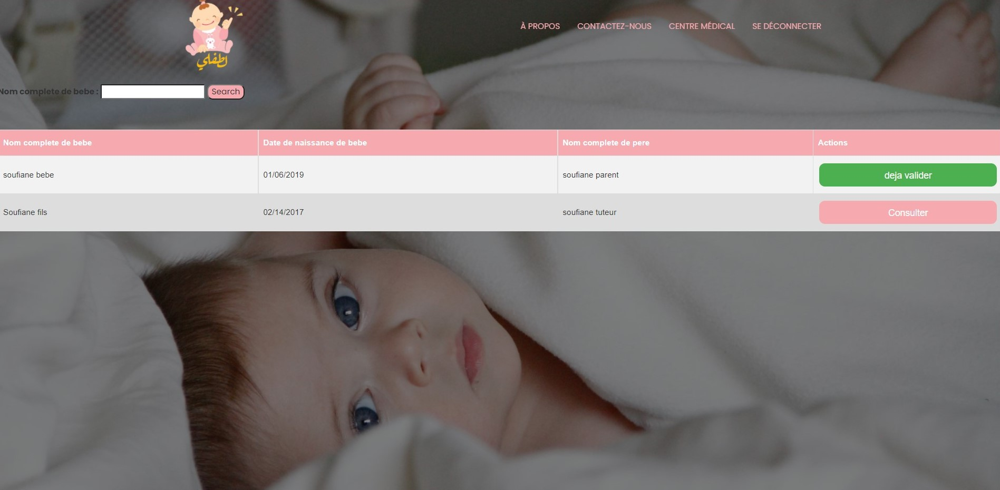

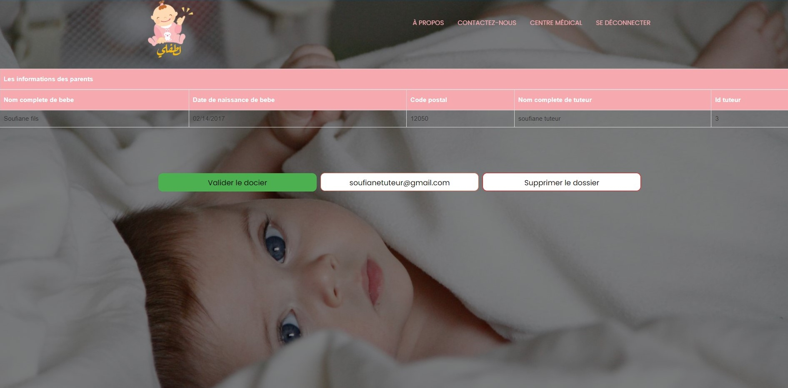
#Doctor
## Doctor account home page

## List of patients page
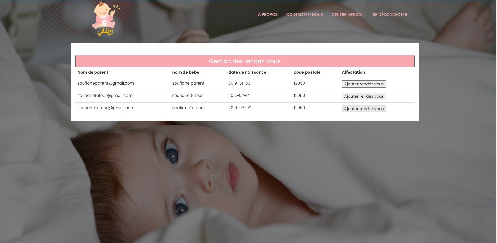
## Assigning appointments page
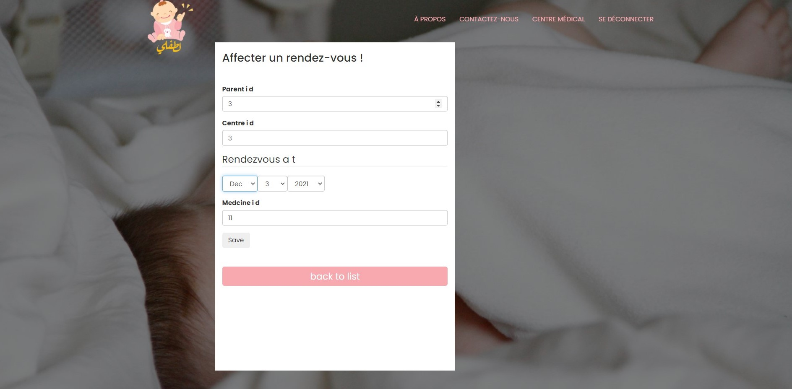

#Parent
## Parent Home page
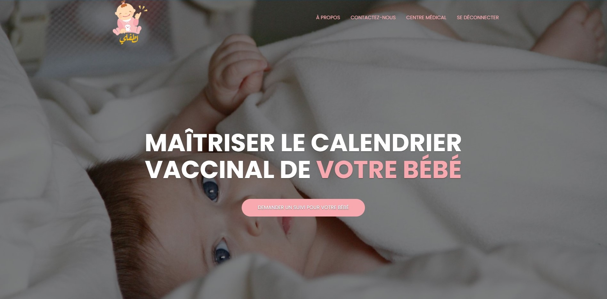
## Request appointment for a baby page
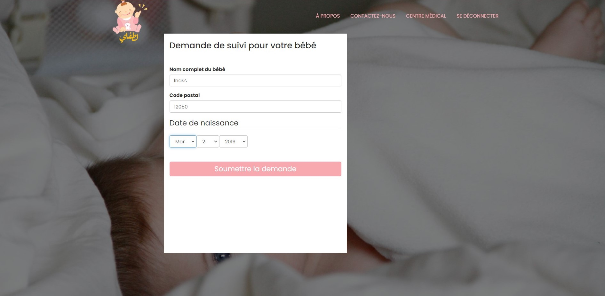

